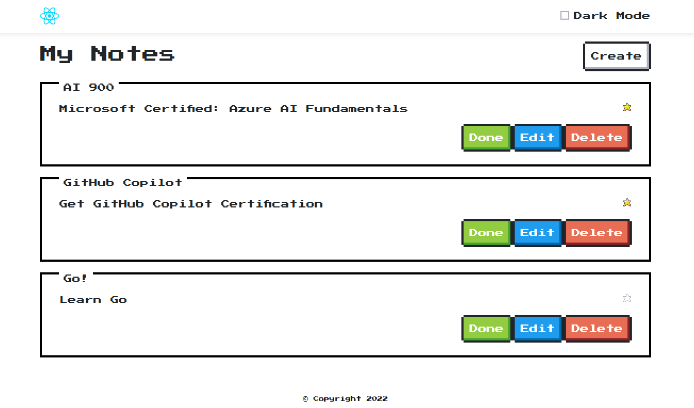

# Notes App



## Description

The **Notes App** is a simple and interactive application for managing notes. It allows users to create, edit, delete, and organize notes with features like dark mode, pinning notes, and marking notes as done.

## Features

- Create, edit, and delete notes.
- Mark notes as done or pin them for priority.
- Dark mode toggle for better accessibility.
- Responsive design for various screen sizes.

## Live Preview

You can view a live preview of the app here: [Notes App Preview](https://saulr9.github.io/notes-app/)

## Getting Started

### Prerequisites

- Node.js (v16 or higher)
- npm or yarn

### Installation

1. Clone the repository:

   ```bash
   git clone https://github.com/saulr9/notes-app.git
   cd notes-app
   ```

2. Install dependencies:

   ```bash
   npm install
   ```

### Running the App

To start the development server:

```bash
npm run dev
```

The app will be available at `http://localhost:5173`.

### Building for Production

To build the app for production:

```bash
npm run build
```

The production-ready files will be in the `dist` directory.

### Running Tests

To run the end-to-end tests using Cypress:

```bash
npm run test
```

## Project Structure

```
├── public/               # Static assets
├── src/                  # Source code
│   ├── components/       # React components
│   ├── context/          # Context providers
│   ├── hooks/            # Custom hooks
│   ├── services/         # API services
│   ├── utils/            # Utility functions
├── cypress/              # Cypress tests
├── package.json          # Project configuration
├── vite.config.js        # Vite configuration
└── README.md             # Project documentation
```
